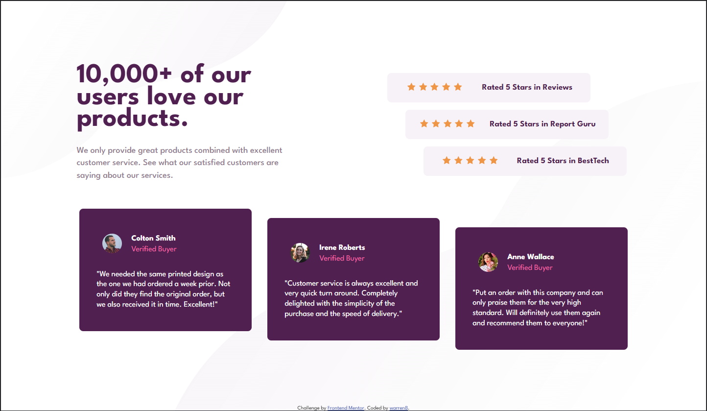

# Frontend Mentor - Social proof section solution

This is a solution to the [Social proof section challenge on Frontend Mentor](https://www.frontendmentor.io/challenges/social-proof-section-6e0qTv_bA). Frontend Mentor challenges help you improve your coding skills by building realistic projects.

## Table of contents

- [Overview](#overview)
  - [The challenge](#the-challenge)
  - [Screenshot](#screenshot)
  - [Links](#links)
- [My process](#my-process)
  - [Built with](#built-with)
  - [What I learned](#what-i-learned)
  - [Continued development](#continued-development)
  - [Useful resources](#useful-resources)
- [Author](#author)
- [Acknowledgments](#acknowledgments)

**Note: Delete this note and update the table of contents based on what sections you keep.**

## Overview

### The challenge

Users should be able to:

- View the optimal layout for the section depending on their device's screen size

### Screenshot



### Links

- Solution URL: [Git Hub](https://github.com/warrenbarney/social-proof-section-master)
- Live Site URL: [Netlify](https://luminous-medovik-007e9c.netlify.app/)

## My process

I'm definetly still learning.  I broke down the sections and sub sections.  Assigned sections flex-directions as needed.
once everything was in the proper place I started styling and fixed as needed until I had a funtional and styled mobile version.  I then started with the desktop version.  I had a few issues with sizing and the background images.  I ran into some nesting issues while styling.  I had fun with this project.

### Built with

- Semantic HTML5 markup
- CSS custom properties
- Flexbox
- Mobile-first workflow
- SCSS

### What I learned

I learned more about image placement.  I learned a little about nesting conflicts.  I learned its not smart to use em on font size although I didnt have an issue I changed em to rem.
It was neat to work with sizing elements so you could use flex styling to get different results.
I learned more about svg's and how to use them.  They seem versatile I just need to learn more.

```html
<div class="star">
            <svg width="17" height="16">
              <use href="#star-icon" />
            </svg>
          </div>
          <div class="star">
            <svg width="17" height="16">
              <use href="#star-icon" />
            </svg>
          </div>
```

```css
   .banner-1 {
        align-self: flex-start;
    }

    .banner-3 {
        align-self: flex-end;
    }
```

### Continued development

I am very excited.  I look forward to creating more pojects researching best practices and refining my skills.

### Useful resources

- [Flex Froggy](https://flexboxfroggy.com/) - I had a  lot of fun playing this game.
- [Background Tutorial](https://www.youtube.com/watch?v=zHZRFwWQt2w&t=18s) - Kevin Powell seems to love CSS a lot who better to learn about background images? 😃

## Author

- Git Hub - [warrenbarney](https://github.com/warrenbarney)
- Frontend Mentor - [@warrenbarney](https://www.frontendmentor.io/profile/warrenbarney)
- Twitter - [@warrenbarney73](https://www.twitter.com/warrenbarney73)

## Acknowledgments

Thank You everyone involved in this awesome community!!!
